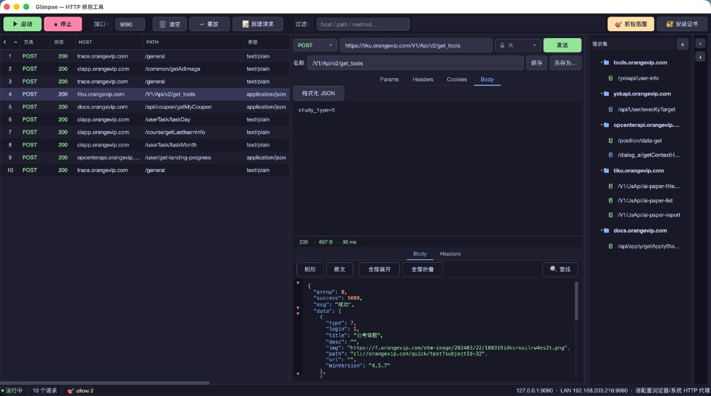

# Glimpse

> 一瞥即见的 HTTP/HTTPS 抓包调试工具

用 Python + PyQt6 实现的 macOS HTTP/HTTPS 抓包调试工具，灵感来自 Proxyman / Charles。



---

## 功能

- HTTP / HTTPS 流量拦截（基于 mitmproxy MITM 中间人）
- HTTPS 自动解密
- 主界面 **左侧流量列表、右侧请求编辑区**：选中一条记录即在右侧载入并可编辑后重发
- 响应 Body JSON 语法高亮；编辑器响应区复用相同展示组件
- 列表关键词过滤 + 列排序（按状态码/耗时/大小/时间）
- 请求重放（⇧⌘R）、Copy as cURL（⌥⌘C）、Copy URL（⇧⌘C）
- **内嵌请求编辑器**：类 Postman 的请求构造与发送（主窗口右侧）
  - **点击流量行**自动载入；工具栏 **📝 新建请求** 清空为空白草稿
  - 支持 Method / URL、Params / Headers / Cookies / Body 可编辑表格，一键发送并查看响应（JSON 高亮）
  - 编辑区**右缘**可展开 **请求集**抽屉（默认收起，`Ctrl+B` 切换）；分组管理已保存请求
  - 数据持久化至 `~/.glimpse/collections.json`（含每条已保存请求的**最后一次发送响应**）
- **Cookie 同步**（编辑器 Cookies 页）：
  - **从抓包流量提取**（推荐）：使用代理捕获时浏览器实际发出的 Cookie，与线上行为一致
  - **从 Chrome 读取**：读取本机 Chrome / Edge Cookie 库（需钥匙串授权「Chrome Safe Storage」）
  - **从 Safari 读取**：解析 `Cookies.binarycookies`
  - Chrome 127+ 的会话 Cookie（如 `PHPSESSID`）采用应用绑定加密，离线读取常失败；鉴权接口建议走代理抓包后使用「从抓包流量提取」
- **抓取作用域 (Capture Scope)**：白名单 / 黑名单 host 模式，支持 `*.example.com` 通配
  - 接入 mitmproxy 的 `allow_hosts` / `ignore_hosts`，白名单外的 HTTPS 直接透传，不解 TLS
  - 解决飞书、银行等做了 SSL Pinning 的 App "网络不可用"问题
  - 右键流量可一键加入白/黑名单
- WebSocket：右侧显示消息流（只读，不可发送）
- iOS / Android 移动端抓包（监听 `0.0.0.0`，状态栏显示 LAN IP）
- 一键安装 CA 证书到 macOS 系统钥匙串（osascript 申请管理员权限）

---

## 安装

> 环境要求：macOS 11+ 、Python 3.9+

```bash
# 1. 克隆项目
git clone git@github.com:hufangfang1/glimpse.git
cd glimpse

# 2. 创建并激活虚拟环境（推荐）
python3 -m venv .venv
source .venv/bin/activate

# 3. 安装依赖
python -m pip install -r requirements.txt
```

之后无论用应用还是命令行运行，都不必再重复以上步骤。

---

## 运行

### 方式一：macOS 应用（推荐）

**首次**——完成上面的「安装」后，在项目根目录生成 `.app`：

```bash
bash scripts/build_app.sh
```

**日常启动**：双击项目里的 **`Glimpse.app`** 即可。

**固定到「应用程序」或启动台**（不要用 Finder 把 `.app` 拖进去复制）——在项目根目录下执行：

```bash
bash scripts/install_app.sh
```

这会在「应用程序」里创建一个**快捷方式**，指向项目内的 `Glimpse.app`。

> **不要**把 `Glimpse.app` **复制**到「应用程序」——复制后往往打不开。  
> 若已经复制过，先删 `/Applications/Glimpse.app`，再运行 `install_app.sh`。  
> 首次打开若被 macOS 拦截：「系统设置 → 隐私与安全性 → 仍要打开」。

### 方式二：命令行

在项目根目录下执行：

```bash
source .venv/bin/activate   # 若尚未激活虚拟环境
python main.py
```

---

## 使用步骤

### 桌面浏览器抓包

1. 点击 **▶ Start** 启动代理（默认端口 9090）
2. 在浏览器或系统网络设置中配置 HTTP 代理：
   - 主机：`127.0.0.1`，端口：`9090`
3. 访问任意网站，流量即出现在列表中
4. 点击 **🔐 Install Cert** 安装 CA 证书（系统会弹出管理员密码对话框），之后 HTTPS 流量也可解密

### iOS / Android 移动设备抓包

1. 确保手机和电脑在**同一 Wi-Fi** 下
2. 启动代理后，查看状态栏中的 **LAN IP**（如 `192.168.1.100:9090`）
   - 在手机 Wi-Fi 详情页设置 HTTP 代理为该地址
3. 在手机浏览器访问 `http://mitm.it`，下载并安装 mitmproxy 证书
   - iOS 还需在「设置 → 通用 → 关于本机 → 证书信任设置」中启用该证书

### 配置抓取范围（Capture Scope）

工具栏点 **🎯 Scope** 或按 `⌘L`：

- **Allow**（白名单）：留空 = 抓所有；填了之后**只**对匹配的 host 做 MITM，其他全部透传
- **Block**（黑名单）：匹配的 host 直接透传（用来屏蔽噪音流量）
- 支持通配：`api.example.com`、`*.example.com`、`*.googleapis.com`
- 想同时覆盖根域名和子域名，请加两行：`example.com` 和 `*.example.com`

配置存于 `~/.glimpse/scope.json`，重启自动加载。

### 请求编辑与 Cookie 同步

1. 在左侧**点击一条流量**，右侧自动载入该请求与抓包响应；或点工具栏 **📝 新建请求** 从空白开始
2. 右侧填写 Method、URL；需要时在**最右竖条**展开请求集抽屉浏览已保存请求
3. 点击 **发送** 查看下方响应区（状态行、Body、Headers）
4. 需要登录态时，在 **Cookies** 页点击 **同步 Cookie**：
   - **从抓包流量提取**：先 **▶ Start** 代理，浏览器走 `127.0.0.1:9090` 并访问目标站，再同步（最可靠）
   - **从 Chrome 读取**：首次会弹出 macOS 钥匙串授权，请选择「允许」或「始终允许」；同一次运行内会缓存密钥
   - 若在地址栏直接打开的 GET 接口，请保持 Method 为 **GET**（勿误用 POST）
5. 点击 **保存** 更新已匹配请求，或按 URL 域名自动分组新建；**另存为…** 可手动选择分组；配置写入 `~/.glimpse/collections.json`

### 请求签名（UC 等 RSA 鉴权）

编辑器 URL 栏旁 **鉴权** 下拉可选 `~/.glimpse/auth.json` 里配置的签名方案；**每次发送**自动刷新 `nonce` / `signTime` 并写入 Header + Body（与 PHP `buildSign` 一致）。

1. 配置签名（任选其一）：
   - 推荐：`cp auth.example.json ~/.glimpse/auth.json` 并填入 `private_key`
   - 开发：直接编辑项目根目录的 `auth.json` 或 `auth.example.json`
2. `private_key` 为 **PEM 字符串**，换行用 `\n`，不要写真实多行
3. 在鉴权下拉选择对应配置后发送（下拉打开时会重新读取配置）
4. 保存到请求集时会记住 `signer_id`；规则变更时改 JSON 或新增 `id`（如 `chenla_uc_v2`）即可，无需改代码

`type` 支持 `chenla_uc` / `rsa_pkcs1_sha1`（同一实现）；`sign_template`、`platform`、`inject` 等均在 JSON 中配置。

---

## 项目结构

```
glimpse/
├── main.py                       # 入口
├── auth.example.json             # 鉴权配置示例（复制到 ~/.glimpse/auth.json）
├── Glimpse.app                   # 运行 build_app.sh 后生成，双击启动
├── requirements.txt
├── assets/
│   ├── AppIcon.png               # 应用图标
│   └── screenshot.png            # README 截图
├── scripts/
│   ├── build_app.sh              # 打包 macOS 应用
│   └── install_app.sh            # 在「应用程序」创建快捷方式
├── proxy/
│   ├── models.py                 # FlowModel 数据模型
│   ├── addon.py                  # mitmproxy Addon（捕获流量）
│   ├── server.py                 # 代理服务器管理
│   ├── scope.py                  # 白/黑名单 host 模式
│   ├── collections.py            # 请求集持久化（分组 + 已保存请求 + 最后响应）
│   ├── cookies.py                # Cookie 来源：抓包 / Chrome / Safari
│   └── signing/                  # 可配置请求签名（auth.json 驱动）
│       ├── store.py              # 读取 ~/.glimpse/auth.json 等配置
│       ├── models.py             # SignerConfig / SignResult
│       ├── registry.py           # 按 type 路由签名实现
│       ├── chenla_uc.py          # UC RSA-SHA1（PHP buildSign 等价）
│       └── apply.py              # 发送前注入 Header + Body
└── gui/
    ├── themes.py                 # 暗色主题与控件尺寸常量
    ├── i18n.py                   # 中英文界面文案
    ├── icons.py                  # 程序绘制的小图标
    ├── main_window.py            # 主窗口（左流量列表 + 右编辑器）
    └── widgets/
        ├── traffic_table.py      # 流量列表
        ├── request_editor.py     # 内嵌请求编辑器（发送 / 保存 / 请求集抽屉 / 鉴权）
        ├── detail_panel.py       # Body / Headers / WebSocket 展示（编辑器响应区复用）
        ├── kv_table.py           # Params / Headers / Cookies 键值表
        └── scope_dialog.py       # 抓取作用域对话框
```

---

## 技术栈

| 组件 | 库 |
|------|-----|
| MITM 代理引擎 | [mitmproxy](https://mitmproxy.org/) |
| GUI 框架 | [PyQt6](https://www.riverbankcomputing.com/software/pyqt/) |
| 请求重放 / 编辑器发送 | [httpx](https://www.python-httpx.org/) |
| Chrome Cookie 解密 | [pycryptodome](https://www.pycryptodome.org/) |

---

## 注意事项

- mitmproxy 首次启动时会在 `~/.mitmproxy/` 目录生成 CA 证书
- 安装证书会通过 `osascript` 申请管理员权限，不会储存密码
- 流量列表最多保留 2000 条，超出后自动丢弃最旧记录
- Scope 改动只对**新建连接**生效，飞书等长连接 App 修改后需要重连
- 编辑抓包记录**不会修改**左侧列表中的历史数据；仅「保存」会写入 `collections.json`
- Chrome Cookie 同步依赖本机 `security` 命令读取钥匙串；Chrome 127+ 部分 Cookie 无法离线解密，请优先使用「从抓包流量提取」
- 用户配置与请求集：`~/.glimpse/scope.json`、`~/.glimpse/collections.json`
- 仅用于合法的调试和开发，请勿用于未授权的网络监控

---

## 许可证

本项目采用 [MIT License](LICENSE) 开源。

GUI 依赖 [PyQt6](https://www.riverbankcomputing.com/software/pyqt/)（GPL v3 或商业授权）。若你**打包分发** macOS 应用，请自行确认是否符合 PyQt6 的许可要求。


